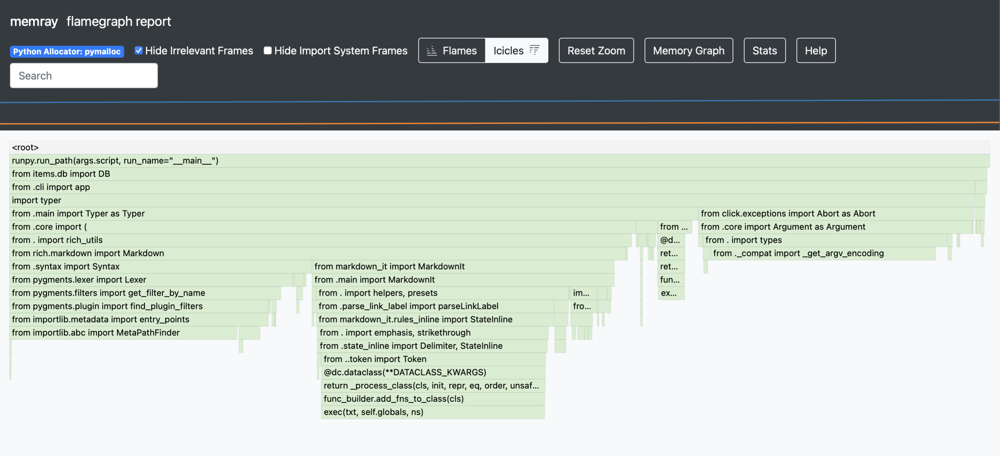

.. SPDX-FileCopyrightText: 2026 Veit Schiele
..
.. SPDX-License-Identifier: BSD-3-Clause

Memray
======

Memory usage is difficult to control in Python projects because the language
does not explicitly indicate where memory is allocated, module imports can
significantly increase consumption, and it is all too easy to create a data
structure that accidentally grows indefinitely. Data science projects are
particularly prone to high memory consumption, as they usually import many large
dependencies such as :doc:`/workspace/numpy/index`, even if these are only used
in a few places.

`Memray <https://bloomberg.github.io/memray/>`_ helps you understand your
programme’s memory usage by tracking where memory is allocated and freed during
programme execution. This data can then be displayed in various ways, including
`flame graphs <https://www.brendangregg.com/flamegraphs.html>`_, which summarise
`stack traces <https://en.wikipedia.org/wiki/Stack_trace>`_ in a diagram, with
the bar width representing the size of the memory allocation.

With ``memray run``, any Python command can be profiled. For most projects, it
is recommended to first use check to profile the function that loads your
project. This checks the minimum effort required to start your application, for
example:

.. code-block:: console

   $ uv run memray run src/items/__init__.py check
   Writing profile results into src/items/memray-__init__.py.72633.bin
   [memray] Successfully generated profile results.

   You can now generate reports from the stored allocation records.
   Some example commands to generate reports:

   /Users/veit/items/.venv/bin/python3 -m memray flamegraph src/items/memray-__init__.py.72633.bin

The command outputs the message ``Successfully generated profile results.`` and
creates a :samp:`{PROCESS-ID}.bin` file. We can then create the flame graph
with:

.. code-block:: console

   $ uv run python -m memray flamegraph src/items/memray-__init__.py.72633.bin
   Wrote src/items/memray-flamegraph-__init__.py.72633.html

.. tip::
   In many consoles, you can combine the two commands with ``&&``:

   .. code-block:: console

      $ uv run memray run src/items/__init__.py check && uv run python -m memray flamegraph src/items/memray-__init__.py.72633.bin

The result is the following HTML file:

   memray flamegraph report

The header area of the page contains several controls, including

*Memory Graph*
    Display of the memory space of a process in the working memory (`resident
    set size <https://en.wikipedia.org/wiki/Resident_set_size>`_) and the
    dynamic memory (heap memory) over time
    die Zeit
*Stats*
    Memory statistics, in this case

    .. code-block:: text

        Command line: /Users/veit/items/.venv/bin/memray run src/items/api.py check
        Start time: Sun Feb 08 2026 12:12:27 GMT+0100 (Central European Standard Time)
        End time: Sun Feb 08 2026 12:12:27 GMT+0100 (Central European Standard Time)
        Duration: 0:00:00.068000
        Total number of allocations: 11142
        Total number of frames seen: 0
        Peak memory usage: 4.6 MB
        Python allocator: pymalloc

Below that is the flame graph as an icicle chart showing memory allocations over
time, with the last call at the bottom. The graph shows the line of code
executed at a given point in time, with the width proportional to the amount of
memory allocated; if you move your mouse over it, you will see further details
such as file name, line number, allocated memory and number of allocations.

.. tip::
   With :ref:`python-basics:pytest_memray`, there is also a plugin for
   :doc:`python-basics:test/pytest/index` that allows you to check whether the
   upper limits you have set for memory consumption and memory leaks are being
   adhered to.
