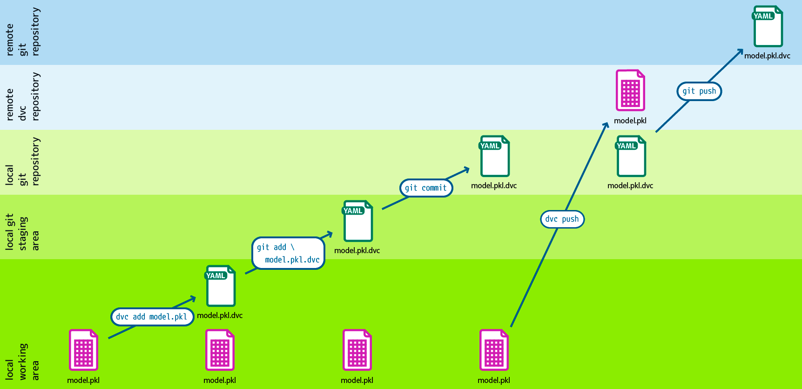

.. SPDX-FileCopyrightText: 2020 Veit Schiele
..
.. SPDX-License-Identifier: BSD-3-Clause

Pipelines
=========

Connecting code and data
------------------------

Commands such as ``dvc add``, ``dvc push``, and ``dvc pull`` can be executed
independently of changes in the Git repository and therefore only provide the
basis for managing large amounts of data and models. To achieve truly
reproducible results, code and data must be connected.

   Design: André Henze, Berlin

With ``dvc stage``, you can create individual processing stages, each of which
is described by a source code file managed with Git, as well as other
dependencies and output data. All stages together then form the DVC pipeline.

In our example `dvc-example <https://github.com/veit/dvc-example>`_, the first
stage is to split the data into training and test data:

.. code-block:: console

   $ uv run dvc stage add \
       -n prepare \
       -p prepare.seed,prepare.split \
       -d src/dvc_example/prepare.py -d data/data.xml \
       -o data/prepared \
       uv run python src/dvc_example/prepare.py data/data.xml

``-n``
    specifies the name of the processing stage.
``-p``
    specifies the parameters from the :file:`params.yaml` file to be used for
    this stage.

    .. seealso::
       :doc:`params`

``-d``
    specifies dependencies for the reproducible command.

    When ``dvc repro`` is called to reproduce the results next time, DVC checks
    these dependencies and decides whether they are up to date or need to be
    re-executed to obtain more recent results.

``-o``
    specifies the output file or output directory.

The generated :file:`dvc.yaml` file then looks like this:

.. code-block:: yaml

   stages:
     prepare:
       cmd: uv run python src/dvc_example/prepare.py data/data.xml
       deps:
       - data/data.xml
       - src/dvc_example/prepare.py
       params:
       - prepare.seed
       - prepare.split
       outs:
       - data/prepared

If you now call ``uv run dvc repro``, the files :file:`test.tsv` and
:file:`train.tsv` will be created in :file:`data/prepared`, and :file:`dvc.lock`
will be written. The directory structure will then look like this:

.. code-block:: console
   :emphasize-lines: 10, 13-18, 23

   ├── .dvc
   ├── .dvcignore
   ├── .git
   ├── .gitignore
   ├── .pre-commit-config.yaml
   ├── .python-version
   ├── .venv
   ├── README.md
   ├── data
   │   ├── .gitignore
   │   ├── data.xml
   │   ├── data.xml.dvc
   │   └── prepared
   │       ├── test.tsv
   │       └── train.tsv
   ├── dvc.lock
   ├── dvc.yaml
   ├── params.yaml
   ├── pyproject.toml
   ├── src
   │   └── dvc_example
   │       ├── __init__.py
   │       └── prepare.py
   └── uv.lock

.. seealso::
   `dvc repro <https://dvc.org/doc/command-reference/repro>`_

The new and modified programme and configuration files should now be managed in
Git:

.. code-block:: console

   $ git add data/.gitignore dvc.lock dvc.yaml src/dvc_example/prepare.py
   $ git commit -m ':sparkles: Add prepare step'

.. hint::
   DVC knows from the pipeline definition that the files in
   :file:`data/prepared` were generated in the ``prepare`` stage. You can
   restore them at any time with ``uv run dvc repro`` or ``uv run dvc commit``.
