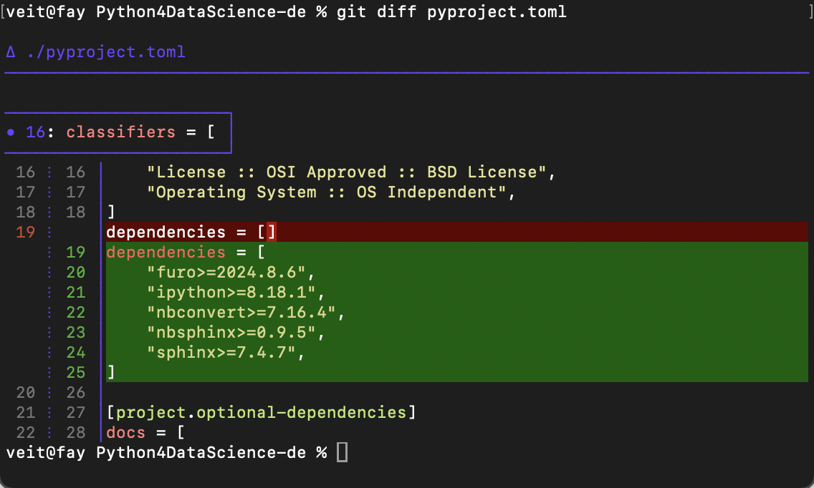
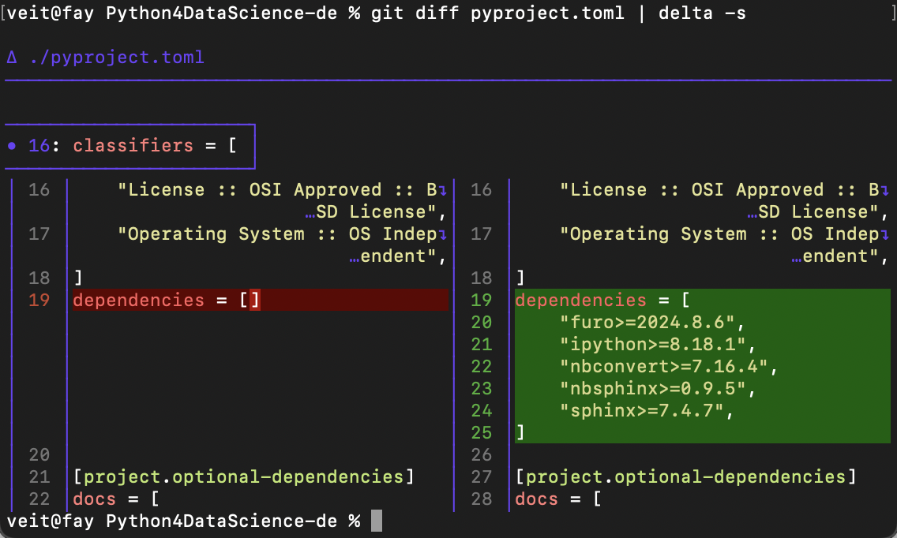

Shell configuration and command line tools
==========================================

In this chapter I would like to introduce you to two powerful shell extensions:

.. tab:: oh-my-zsh

   `oh-my-zsh <https://ohmyz.sh>`_ can be used for the `Z Shell
   <https://zsh.sourceforge.io>`_.

   .. seealso::
      * `Getting Started <https://github.com/ohmyzsh/ohmyzsh#getting-started>`_
      * `Plugins <https://github.com/ohmyzsh/ohmyzsh/wiki/Plugins>`_
      * `Git Plugin Aliases
        <https://github.com/ohmyzsh/ohmyzsh/blob/master/plugins/git/README.md#aliases>`_
      * `zsh-you-should-use
        <https://github.com/MichaelAquilina/zsh-you-should-use>`_

.. tab:: Starship

  `Starship <https://starship.rs>`_ is a fast tool that you can use with any
  shell.

  * `git_branch-Modul <https://starship.rs/config/#git-branch>`_
  * `git_commit-Modul <https://starship.rs/config/#git-commit>`_
  * `git_state <https://starship.rs/config/#git-state>`_
  * `git_status-Modul <https://starship.rs/config/#git-status>`_

Pipes (``|``)
-------------

Git never uses `less <https://www.greenwoodsoftware.com/less/>`_ if you redirect
the output to another programme, for example

.. code-block:: console

   $ git log --oneline | grep Jupyter

However, you can pass the output back to ``less``:

.. code-block:: console

   $ git log --oneline | grep Jupyter | less

.. _git-delta:

delta
-----

`delta <https://dandavison.github.io/delta/>`_ is a smart diff display, see for
example:

Installation
~~~~~~~~~~~~

.. tab:: Debian/Ubuntu

   The :file:`.deb` files can be found on the `Release
   <https://github.com/dandavison/delta/releases>`_ page.

.. tab:: macOS

   .. code-block:: console

      $ brew install git-delta

.. tab:: Windows

   .. code-block:: ps1

      > choco install delta

.. _delta_config:

Configuration
~~~~~~~~~~~~~

An example configuration can be found in `Git config file
<https://dandavison.github.io/delta/configuration.html#git-config-file>`_:

.. code-block:: ini

   [core]
       pager = delta

   [interactive]
       diffFilter = delta --color-only

   [delta]
       navigate = true  # use n and N to move between diff sections

   [merge]
       conflictstyle = zdiff3

However, delta not only extends the display of ``git diff``, but also that of
``git add --patch``, ``git log --patch``, ``git blame``, ``git rebase`` merge
conflicts and ``git show``. In addition, delta can also display side-by-side
diffs, for example:

You can also configure this globally with:

.. code-block:: console

   $ git config --global delta.side-by-side true

ripgrep
-------

Installation
~~~~~~~~~~~~

.. tab:: Debian/Ubuntu

   You can install ripgrep with a binary :file:`.deb` file, which is included in
   every `ripgrep release  <https://github.com/BurntSushi/ripgrep/releases>`_.

   .. code-block:: console

      $ curl -LO https://github.com/BurntSushi/ripgrep/releases/download/14.1.0/ripgrep_14.1.0-1_amd64.deb
      $ sudo dpkg -i ripgrep_14.1.0-1_amd64.deb

.. tab:: macOS

   .. code-block:: console

      $ brew install ripgrep

.. tab:: Windows

   .. code-block:: ps1

      > choco install ripgrep

.. seealso::
   * `rpgrep Installation
     <https://github.com/BurntSushi/ripgrep/blob/master/README.md#installation>`_

Examples
~~~~~~~~

.. note::
   The package is called ``ripgrep``, but the command is ``rg``.

:samp:`$ rg {PATTERN}`
    searches for regexes, whereby you should often use inverted commas to
    prevent the shell from interpreting special characters.
:samp:`$ rg {PATTERN} {FILENAMES}`
    restricts the search to certain files by naming them according to the
    pattern.
:samp:`$ rg -g|--glob {PATTERN}`
    filters files according to so-called `globbing
    <https://en.wikipedia.org/wiki/Glob_(programming)>`_ patterns.
:samp:`$ rg -t {SUFFIX} {PATTERN}`
    searches for files with certain file extensions.

    With ``rg --type-list`` you get all possible file extensions.

:samp:`$ rg -i|--ignore-case {PATTERN}`
    ignores upper and lower case.
:samp:`$ rg --hyperlink-format {EDITOR} {PATTERN}`
    creates file paths as terminal hyperlinks that can be opened by holding down
    the :kbd:`Strg` or :kbd:`⌘` key. Possible editors can be obtained with
    ``man rg``.
:samp:`$ rg --no-ignore {PATTERN}`, :samp:`$ rg -.|--hidden {-.PATTERN}`, :samp:`$ rg --binary {PATTERN}` or :samp:`$ rg -u |--unrestricted {PATTERN}`
    also displays results in files that are usually filtered out by
    ``.gitignore`` statements, by ``.`` hidden files or binary files.

    .. tip::
       :samp:`$ rg -.|--hidden {-.PATTERN}` also displays results in the
       :file:`.git` directory. To exclude this directory from the search, you
       can exclude this directory with the :samp:`-g|--glob` option and a ``!``,
       for example :samp:`rg -. -g '!.git' {PATTERN}`.

Configuration
~~~~~~~~~~~~~

You can create a configuration file for ripgrep in :file:`~/.config/ripgreprc`,
for example:

.. code-block:: console

    --hyperlink-format
    default
    --smart-case
    --hidden
    --glob
    !.git

You can then define the ``RIPGREP_CONFIG_PATH`` environment variable with

.. code-block:: console

   $ export RIPGREP_CONFIG_PATH=~/.config/ripgreprc
