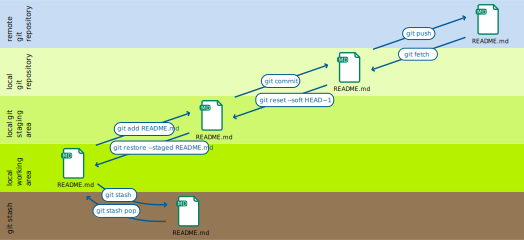

.. SPDX-FileCopyrightText: 2020 Veit Schiele
..
.. SPDX-FileContributor: Modified by Kristian Rother
..
.. SPDX-License-Identifier: BSD-3-Clause

Workspaces
==========

Git manages multiple locations or **workspaces** where files are stored:

local working copy
    contains files and folders that can be edited normally.
staging area
    contains changes to files that are scheduled for writing into the version
    history.
local repository
    contains the entire history of all files in the project.
remote repository
    also contains the entire history, but is stored on a remote server.
stash
    contains changes that are temporarily stored somewhere else to move them out
    of the way.

Basic Git commands
------------------

The following basic Git commands are used to move changes between these
workspaces.

.. hint::
   Shell commands use a Bash-compatible syntax. They should therefore be
   compatible with the most common shells used for Git:

   * Windows: Git Bash
   * WSL: Bash
   * Linux: Bash or Zsh
   * macOS: Zsh

   You may have to adjust the syntax slightly if you use a different shell, for
   example PowerShell.

.. hint::
   This book concentrates on the command line and only deals with :abbr:`GUI
   (Graphical user interface)`’s in passing. The command line is the most
   powerful way to use Git. GUIs implement only a subset of what is possible
   with Git and the shell. Nevertheless, a hybrid approach is possible and
   widely used with many GUIs: You can use a GUI for tasks, and the CLI for
   full performance. You can select a suitable GUI tool in `GUI Clients
   <https://git-scm.com/downloads/guis>`_.

``git add``
    adds files from the working directory to the staging area.
``git reset HEAD``
    restores a file in the work area from the stage area.
``git stash``
    moves files from the workspace to a stash.

    .. seealso::
       * :ref:`Working with Git <git-stash>`

``git commit``
    writes changes from the staging area to the local repository.
``git pull``
    copies changes from the remote to the local repository and updates the work area.
``git push``
    copies changes from the local repository to the remote repository.

    :samp:`git push -u {UPSTREAM} {BRANCHNAME}`
        ``-u`` (long form ``--set-upstream``)
          allows to specify the remote repository and a branch in it.

        :samp:`{UPSTREAM}`
            the name of the remote repository, typically ``origin``.

        :samp:`{BRANCHNAME}`
            the name of a branch in the remote repository,
            typically the same as in the local repository.
