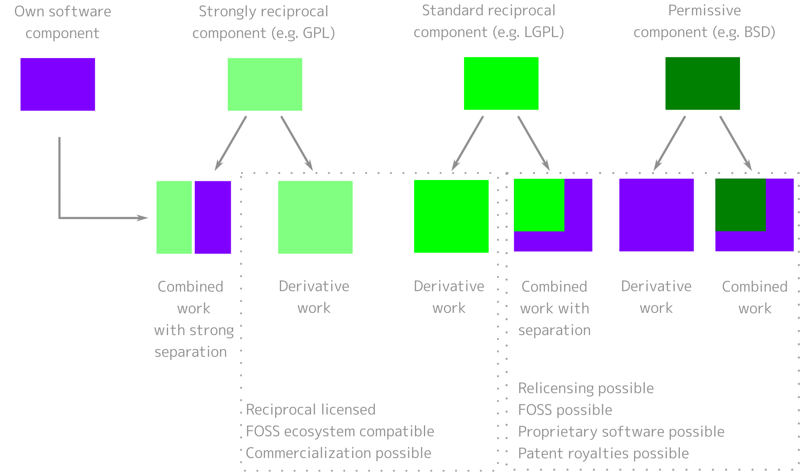

.. SPDX-FileCopyrightText: 2020 Veit Schiele
..
.. SPDX-License-Identifier: BSD-3-Clause

Licensing
=========

In order for others to use your software, it should have one or more licences
that describe the terms of use. Otherwise, it is likely to be protected by
copyright. Authors are those who have originally contributed to the software. If
software is to be licensed, the consent of all those who can claim authorship is
required.

.. note::
   This does not constitute legal advice. If in doubt, contact a lawyer or the
   legal department of your company.

.. seealso::
   * `The Whys and Hows of Licensing Scientific Code
     <https://www.astrobetter.com/blog/2014/03/10/the-whys-and-hows-of-licensing-scientific-code/>`_
   * `A Quick Guide to Software Licensing for the Scientist-Programmer
     <https://journals.plos.org/ploscompbiol/article?id=10.1371/journal.pcbi.1002598>`_
   * Karl Fogel: `Producing Open Source Software <https://producingoss.com/>`_
   * `Forschungsdaten veröffentlichen
     <https://forschungsdaten.info/themen/rechte-und-pflichten/forschungsdaten-veroeffentlichen/>`_

Proprietary software licenses
-----------------------------

Proprietary software licenses are rarely standardised; they can be commercial,
shareware, or freeware.

Free and open source software licenses
--------------------------------------

They are defined by the `Free Software Foundation (FSF)
<https://www.fsf.org/de/?set_language=de>`_ and the `Open Source Initiative
(OSI) <https://opensource.org/>`_. A distinction can essentially be made between
copyleft, permissive and public domain licenses.

Copyleft or reciprocal licences
~~~~~~~~~~~~~~~~~~~~~~~~~~~~~~~

Copyleft licences oblige the licensees to place any adaptation of the software
(so-called derivatives) under the licence of the original work. This is intended
to prevent restrictions on the use of the software. The best-known copyleft
licence is the `GPL (GNU General Public License)
<https://en.wikipedia.org/wiki/GNU_General_Public_License>`_. The copyleft of
the :abbr:`GPL (GNU General Public License)` is considered very strong, while
that of the `Mozilla Public License
<https://en.wikipedia.org/wiki/Mozilla_Public_License>`_ is considered very
weak.

Since the licensors are not bound by their own copyleft, they can also publish
new versions under a proprietary license or allow third parties to do so
(multiple licensing).

Copyleft licenses can quickly lead to incompatibilities with free licenses
without copyleft. For example, the 3 Clause BSD license is incompatible with the

However, copyleft licences can quickly create incompatibilities when distributed
together with software under other free licences. For example, the 3-Clause BSD
licence is incompatible with the :abbr:`GPL (GNU General Public License)`.

The `EUPL
<https://interoperable-europe.ec.europa.eu/collection/eupl/introduction-eupl-licence>`_,
on the other hand, is a reciprocal licence that is at least compatible and
interoperable with most other open reciprocal licences: the compatible licence
obligations take precedence if they conflict with the obligations arising from
the EUPL.

Permissive open source licenses
~~~~~~~~~~~~~~~~~~~~~~~~~~~~~~~

Permissive open source licenses allow broader reuse than copyleft licenses.
Derivatives and copies of the source code can be distributed under conditions
that have fundamentally different properties than those of the original license.
The best known examples of such licenses are `MIT
<https://en.wikipedia.org/wiki/MIT_License>`_ and `BSD
<https://en.wikipedia.org/wiki/BSD_licenses>`_.

Public domain licenses
~~~~~~~~~~~~~~~~~~~~~~

With public domain licences, the copyrights are transferred to the general
public. The `WTFPL <https://en.wikipedia.org/wiki/WTFPL>`_ was created to mark
the public domain of software.

Non-software licences
---------------------

Open source software licences can also be used for works that are not software.
They are often also the best choice, especially if the works in question are
edited and versioned as source code.

Data, media, :abbr:`etc. (et cetera)`
~~~~~~~~~~~~~~~~~~~~~~~~~~~~~~~~~~~~~

`CC0 1.0 <https://creativecommons.org/publicdomain/zero/1.0/deed.de>`_,
`CC BY 4.0 <https://creativecommons.org/licenses/by/4.0/deed.de>`_ and
`CC BY-SA 4.0 <https://creativecommons.org/licenses/by-sa/4.0/deed.de>`_ are
open licences used for non-software material, from datasets to videos. However,
they are `not recommended for software
<https://creativecommons.org/faq/#can-i-apply-a-creative-commons-license-to-software>`_.

The `Open Knowledge Foundation <https://okfn.org/en/>`_ has also published a set
of `Open Data Commons <https://opendatacommons.org>`_ licences for
data/databases:

`Open Data Commons Open Database License (ODbL) v1.0 <https://opendatacommons.org/licenses/odbl/1-0/>`_
    Attribution and sharing under equal terms.
`Open Data Commons Attribution License (ODC-By) v1.0 <https://opendatacommons.org/licenses/by/1-0/>`_
    Attribution.
`Open Data Commons Public Domain Dedication and License (PDDL) v1.0 <https://opendatacommons.org/licenses/pddl/1-0/>`_
    The PDDL places the data in the public domain and waives all rights.

`GovData <https://www.govdata.de>`_ has submitted the *Data Licence Germany* in two variants:

* `Datenlizenz Deutschland – Namensnennung – Version 2.0
  <https://www.govdata.de/dl-de/by-2-0>`_
* `Datenlizenz Deutschland – Zero – Version 2.0
  <https://www.govdata.de/dl-de/zero-2-0>`_

When using the `Community Data License Agreement – Permissive, Version 2.0 <https://cdla.dev/permissive-2-0/>`_ the copyright notices must be retained.

Another possible licence for artistic works is the `Free Art License 1.3
<https://artlibre.org/licence/lal/en/>`_.

Documentation
~~~~~~~~~~~~~

Any open source software licence or open media licence also applies to software
documentation. If you use different licences for your software and its
documentation, you should make sure that the source code examples in the
documentation are also licensed under the software licence. In addition to the
Creative Commons licences mentioned above, the following licences are available
specifically for free documentation.

`GNU Free Documentation License (FDL) <https://www.gnu.org/licenses/fdl-1.3.txt>`_
    Copyleft licence for documentation to be used for all GNU manuals. Its
    applicability is limited to textual works (books).
`FreeBSD Documentation License <https://www.freebsd.org/copyright/freebsd-doc-license/>`_
    Permissive documentation licence with copyleft, compatible with the GNU FDL.
`Open Publication License, Version 1.0 <https://opencontent.org/openpub/>`_
    Free documentation licence with copyleft, provided none of the licence
    options in Section VI of the licence are used. In any case, it is
    incompatible with the GNU FDL.

Fonts
~~~~~

`SIL Open Font License 1.1 <https://opensource.org/license/OFL-1.1>`_
    Font licence that can be freely used in other works.
`GNU General Public License 3 <https://www.gnu.org/licenses/gpl-3.0>`_
    It can also be used for fonts, but it may only be included in documents with
    the `font exception
    <https://www.gnu.org/licenses/gpl-faq.html#FontException>`_.

    .. seealso::
       * `Font Licensing <https://www.fsf.org/blogs/licensing/20050425novalis>`_

`LaTeX ec fonts <https://ctan.joethei.xyz/fonts/ec/src/copyrite.txt>`_
    Free *European Computer Modern and Text Companion* fonts commonly used with
    Latex.
`Arphic Public License <https://spdx.org/licenses/Arphic-1999>`_
    Free licence with copyleft.
`IPA Font license <https://spdx.org/licenses/IPA.html>`_
    Free licence with copyleft, but derived values may not use or contain the
    name of the original.

Hardware
~~~~~~~~

Designs for `open source hardware <https://www.oshwa.org/definition/>`_ are
covered by the CERN Open Hardware licences:

`CERN-OHL-P-2.0 <https://ohwr.org/cern_ohl_p_v2.txt>`_
    permissive
`CERN-OHL-W-2.0 <https://ohwr.org/cern_ohl_w_v2.txt>`_
    weakly reciprocal
`CERN-OHL-S-2.0 <https://ohwr.org/cern_ohl_s_v2.txt>`_
    strongly reciprocal

.. seealso::
   * `Certified Open Source Hardware Projects
     <https://certification.oshwa.org/list.html>`_

Choosing a suitable license
---------------------------

Overviews of possible licenses can be found in the `SPDX License List
<https://spdx.org/licenses/>`_ or `OSI Open Source Licenses by Category
<https://opensource.org/licenses#toggle-license-categories>`_. When choosing
suitable licences, the websites `Choose an open source license
<https://choosealicense.com/>`_ and `Comparison of free and open-source software
licenses
<https://en.wikipedia.org/wiki/Comparison_of_free_and_open-source_software_licenses>`_
will help you.

If you want to achieve the widest possible distribution of your package, for
example, MIT or BSD versions are a good choice. The Apache licence protects you
better from from patent infringement, but it is not compatible with the GPL v2.

Check dependencies
~~~~~~~~~~~~~~~~~~

In addition, you should look at what licences those packages have that you
depend on and should be compatible with:

   Licence compatibility for derivative works or combined works of own code and
   external code licensed under an open source licence (from `Licence
   compatibility <https://en.wikipedia.org/wiki/License_compatibility>`_,
   following `The Rise of Open Source Licensing
   <https://www.turre.com/pub/openbook_valimaki.pdf>`_ p. 119).

To analyse licences, you can look at `license
compatibility <https://en.wikipedia.org/wiki/License_compatibility>`_.

With `liccheck <https://github.com/dhatim/python-license-check/tree/master>`_
you can check Python packages and their dependencies with a
:file:`requirement.txt` file, for example:

    .. code-block:: console

        liccheck -s liccheck.ini -r requirements.txt
        gathering licenses...
        3 packages and dependencies.
        check unknown packages...
        3 packages.
            cffi (1.15.1): ['MIT']
              dependency:
                  cffi << cryptography
            cryptography (41.0.3): ['Apache Software', 'BSD']
              dependency:
                  cryptography
            pycparser (2.21): ['BSD']
              dependency:
                  pycparser << cffi << cryptography

Furthermore, it can also be useful to publish a package under several licences.
An example of this is `cryptography/LICENSE
<https://github.com/pyca/cryptography/blob/adf234e/LICENSE>`_:

    This software is made available under the terms of *either* of the licenses
    found in LICENSE.APACHE or LICENSE.BSD. Contributions to cryptography are
    made under the terms of *both* these licenses.

    The code used in the OpenSSL locking callback and OS random engine is
    derived from the same in CPython, and is licensed under the terms of the PSF
    License Agreement.

GitHub
------

On `GitHub <https://github.com/>`_ you can have an open source license created
in your repository.

#. Go to the main page of your repository.
#. Click on *Create new file* and then enter ``LICENSE`` or ``LICENSE.md`` as
   the file name.
#. Then you can click on *Choose a license template*.
#. Now you can select the open source license that is suitable for your
   repository.
#. You will now be asked for additional information if the selected license
   requires this.
#. After you have given a commit message, for example ``Add license``, you can
   click on *Commit new file*.

If you’ve already added a :file:`/LICENSE` file to your repository, GitHub uses
`licensee <https://github.com/licensee/licensee>`_ to compare the file with a
short `list of open source licenses <https://choosealicense.com/appendix/>`_. If
GitHub can’t detect your repository’s license, it might contain multiple
licenses or be too complex. Then consider whether you can simplify the license,
for example by outsourcing complexity to the :file:`/README` file.

Conversely, you can also search for repositories with specific licenses or
license families on GitHub. You can get an overview of the license keywords in
`Searching GitHub by license type
<https://docs.github.com/en/repositories/managing-your-repositorys-settings-and-features/customizing-your-repository/licensing-a-repository#searching-github-by-license-type>`_.

Finally, you can have `Shields.io <https://shields.io/>`_ generate a license
badge for you, which you can include in your ``README`` file, for example

.. code-block:: rst

    |License|

    .. |License| image:: https://img.shields.io/github/license/veit/python4datascience.svg
       :target: https://github.com/cusyio/Python4DataScience/blob/main/LICENSE

|License|

.. |License| image:: https://img.shields.io/github/license/veit/python4datascience.svg
   :target: https://github.com/cusyio/Python4DataScience/blob/main/LICENSE

.. _standard_format_licensing:

Standard format for licensing
-----------------------------

`SPDX <https://spdx.dev/>`_ stands for *Software Package Data Exchange* and
defines a standardised method for the exchange of copyright and licensing
information between projects and people. You can choose the appropriate SPDX
identifiers from the `SPDX License List <https://spdx.org/licenses/>`_ and then
add to the header of your licence files:

.. code-block::

    # SPDX-FileCopyrightText: [year] [copyright holder] <[email address]>
    #
    # SPDX-License-Identifier: [identifier]

Check conformity
----------------

.. _reuse:

REUSE
~~~~~

`REUSE <https://reuse.software/>`__ was initiated by the Free Software
Foundation Europe (FSFE) to facilitate the licensing of free software projects.
The `REUSE tool <https://git.fsfe.org/reuse/tool>`_ checks licenses and supports
you in compliance with the license, for example:

.. code-block:: console

    reuse lint
    # MISSING COPYRIGHT AND LICENSING INFORMATION

    The following files have no copyright and licensing information:
    * .gitattributes
    * .github/ISSUE_TEMPLATE/openssl-release.md
    ...
    * vectors/cryptography_vectors/x509/wosign-bc-invalid.pem
    * vectors/pyproject.toml

    The following files have no licensing information:
    * docs/_ext/linkcode_res.py
    * src/cryptography/__about__.py

    # SUMMARY

    * Bad licenses: 0
    * Deprecated licenses: 0
    * Licenses without file extension: 0
    * Missing licenses: 0
    * Unused licenses: 0
    * Used licenses: 0
    * Read errors: 0
    * files with copyright information: 2 / 2806
    * files with license information: 0 / 2806

    Unfortunately, your project is not compliant with version 3.0 of the REUSE Specification :-(

With the `REUSE API <https://reuse.software/dev/#api>`_ you can also generate a
dynamic compliance badge:

.. figure:: reuse-compliant.svg
   :alt: REUSE-compliant Badge

.. _reuse-in-gitlab-ci:

CI workflow
:::::::::::

You can easily integrate REUSE into your continuous integration workflow:

.. tab:: Pre-commit

    You can automatically run ``reuse lint`` as a :doc:`pre-commit hook
    <git/advanced/hooks/pre-commit>` on every commit by adding the following to your
    :file:`.pre-commit-config.yaml`:

    .. code-block:: yaml

        repos:
        - repo: https://github.com/fsfe/reuse-tool
          rev: v2.1.0
          hooks:
          - id: reuse

.. tab:: GitLab

    Add the following to the :file:`.gitlab-ci.yml` file:

    .. code-block:: yaml

        reuse:
          image:
            name: fsfe/reuse:latest
            entrypoint: [""]
          script:
            - reuse lint

.. tab:: GitHub

    On GitHub you can integrate the REUSE action into your workflow with the
    GitHub Action `REUSE Compliance Check
    <https://github.com/marketplace/actions/reuse-compliance-check>`_, for
    example, by adding the following to your :file:`workflow .yml` file:

    .. code-block:: yaml

        name: REUSE Compliance Check

        on: [push, pull_request]

        jobs:
          test:
            runs-on: ubuntu-latest
            steps:
            - uses: actions/checkout@v3
            - name: REUSE Compliance Check
              uses: fsfe/reuse-action@v2

Alternatives
::::::::::::

.. _open_chain:

`ISO/IEC 5230/OpenChain <https://de.wikipedia.org/wiki/ISO/IEC_5230>`_
    recommends :ref:`REUSE <reuse>` as a component to improve license and
    copyright clarity, but sets higher requirements to achieve full compliance.

    It is based on `OpenChain Specification 2.1
    <https://raw.githubusercontent.com/OpenChain-Project/License-Compliance-Specification/master/2.1/de/OpenChain-2.1_original_de.pdf>`_
    and is an international standard on software supply chains, simplified
    procurement, and open source license compliance.

    .. seealso::

       * `OpenChain project <https://openchainproject.org>`_
       * `OpenChain Self Certification
         <https://openchainproject.org/get-started>`_
       * `Reference-Material
         <https://github.com/OpenChain-Project/Reference-Material>`_

`ScanCode <https://aboutcode.org/scancode/>`_
    offers a range of tools and applications for scanning software codebases and
    packages to determine the origin and licence (provenance) of open source
    software (and other third-party software).

    `DeltaCode <https://github.com/aboutcode-org/deltacode>`_
        compares two codebase scans to detect significant changes.

`ClearlyDefined <https://clearlydefined.io/>`_
    collects and displays information about the licensing and copyright
    situation of a software project.

    .. figure:: clearly-defined.png
       :alt: Screenshot of the ClearlyDefined website with cryptography example

`FOSSology <https://www.fossology.org/>`_
    is a free software compliance toolkit that stores information in a database
    with license, copyright, and export scanners.

`OSS Review Toolkit (ORT) <https://github.com/oss-review-toolkit/ort>`_
    is a toolkit for automating and orchestrating FOSS policies, allowing you to
    manage your (open source) software dependencies. It

    * generates `OWASP CycloneDX <https://cyclonedx.org>`_, `SPDX Software Bill
      of Materials (SBOM)
      <https://github.com/opensbom-generator/spdx-sbom-generator>`_ or custom
      FOSS attribution documentation for your software project
    * automates your FOSS policy to check your software project and its
      dependencies for licensing, security vulnerabilities, source code and
      technical standards
    * create a source code archive for your software project and its
      dependencies to comply with specific licenses
    * correct package metadata or license findings yourself

    .. seealso::
       * `GitHub Action for ORT
         <https://github.com/oss-review-toolkit/ort-ci-github-action>`_
       * `ORT for GitLab <https://github.com/oss-review-toolkit/ort-ci-gitlab>`_

`licensechecker <https://boyter.org/2018/03/licensechecker-command-line-application-identifies-software-license/>`_
    A command line tool that scans installation directories for licences.

Python package metadata
-----------------------

With :pep:`658` the :file:`METADATA` file from distributions becomes available
in the :pep:`503` repository API on :term:`PyPI`. This allows the metadata of
:doc:`distribution packages <python-basics:packs/distribution>` to be analysed
without having to download the whole package.

In Python packages there are other fields where licence information is stored,
such as the `core metadata specifications
<https://packaging.python.org/en/latest/specifications/core-metadata/>`_, which
are also limited. This leads not only to problems for authors to specify the
correct licence, but also to problems when re-packaging for various Linux
distributions.

Currently, although some common cases are covered and the licence classification
can also be extended, there are some popular classifications such as
:samp:`License :: OSI Approved :: BSD License` that will be abolished. However,
this means that backwards compatibility is no longer guaranteed and the packages
have to be relicensed. At least you have a way to check your trove
classifications with `trove-classifiers
<https://github.com/pypa/trove-classifiers>`_.

.. seealso::
   * :pep:`639` – Improving License Clarity with Better Package Metadata
   * :pep:`621` – Storing project metadata in pyproject.toml
   * :pep:`643` – Metadata for Package Source Distributions
