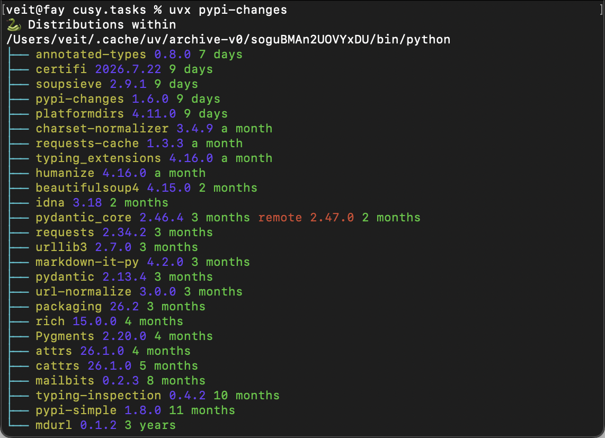

.. SPDX-FileCopyrightText: 2023 cusy GmbH
..
.. SPDX-License-Identifier: BSD-3-Clause

Dependencies
============

This is precisely where attacks on the software supply chain take place. The
`OpenSSF Secure Supply Chain Consumption Framework (S2C2F)
<https://github.com/ossf/s2c2f>`_ provides a structured maturity model for how
organisations should use open-source software. Unfortunately, however, the
:abbr:`S2C2F (Secure Supply Chain Consumption Framework)` is limited to GitHub
projects. We therefore sought comparable solutions for our Python projects that
do not rely on GitHub.

.. seealso::
   * `OpenSSF Scorecard <https://securityscorecards.dev/>`_
   * :ref:`open_chain`
   * `CNCF Software Supply Chain Security Whitepaper
     <https://tag-security.cncf.io/community/working-groups/supply-chain-security/supply-chain-security-paper-v2/Software_Supply_Chain_Practices_whitepaper_v2.pdf>`_

Choose your dependencies carefully
----------------------------------

Before adding a dependency, you should check whether you actually need it, as
every dependency increases your attack surface. Fewer or smaller dependencies
mean fewer potential points of attack. When you add a dependency, you can assess
the security situation using the `OpenSSF Scorecard
<https://securityscorecards.dev>`_:

A low score gives you an indication of how much trust you should place in a
project with limited security practices.

Is there a security policy?
~~~~~~~~~~~~~~~~~~~~~~~~~~~

Ideally, a :ref:`python-basics:security` file or similar should have been
published alongside the dependency. This file should contain information on

* how a security vulnerability can be reported without it becoming publicly
  visible,
* the procedure and timeline for disclosing the vulnerability,
* and links, such as URLs and email addresses, where support can be requested.

.. seealso::
   * `Guide to implementing a coordinated vulnerability disclosure process for
     open source projects
     <https://github.com/ossf/oss-vulnerability-guide/blob/main/maintainer-guide.md>`_
   * `Adding a security policy to your repository
     <https://docs.github.com/de/code-security/how-tos/report-and-fix-vulnerabilities/configure-vulnerability-reporting/add-security-policy>`_
   * `Runbook
     <https://github.com/ossf/oss-vulnerability-guide/blob/main/runbook.md>`_

Are CI tests carried out?
~~~~~~~~~~~~~~~~~~~~~~~~~

Before code is merged into pull or merge requests, tests should be carried out
to help identify errors at an early stage and reduce the number of
vulnerabilities in a project.

.. seealso::
   * :ref:`coverage-github-actions`

Are fuzzing tools used?
~~~~~~~~~~~~~~~~~~~~~~~

Fuzzing, or fuzz testing, feeds unexpected or random data into your programme to
uncover bugs. Regular fuzzing is important for identifying vulnerabilities that
could be exploited by others, particularly as fuzzing can also be used during an
attack to find the same vulnerabilities.

* Does your project use `fuzzing <https://owasp.org/www-community/Fuzzing>`_?
* Is the repository name included in the `OSS-Fuzz
  <https://github.com/google/oss-fuzz>`_ project list?
* Is `ClusterFuzzLite <https://google.github.io/clusterfuzzlite/>`_ used in the
  repository?
* Are there any custom language-specific fuzzing functions in the repository,
  for example using `atheris <https://pypi.org/project/atheris/>`_?

Are static code analysis tools used?
~~~~~~~~~~~~~~~~~~~~~~~~~~~~~~~~~~~~

:term:`Static test procedures` test the source code before the application is
run. This can prevent known classes of errors from being inadvertently
introduced into the codebase.

Is the source code free of checked-in binary files?
~~~~~~~~~~~~~~~~~~~~~~~~~~~~~~~~~~~~~~~~~~~~~~~~~~~

Generated executable files in the source code repository (such as Python
:file:`.pyc` files) increase the risk, as they are difficult to verify and may
therefore be out of date or have been maliciously manipulated. These issues can
be addressed with verified, reproducible builds; however, the resulting
executable files should not be placed back into the source code repository.

.. seealso::
   * `Reproducible Builds <https://reproducible-builds.org>`_
   * `Python 3.12.0 from a supply chain security perspective
     <https://sethmlarson.dev/security-developer-in-residence-weekly-report-13>`_
   * `Defending against the PyTorch supply chain attack PoC
     <https://sethmlarson.dev/security-developer-in-residence-weekly-report-25>`_

Can malicious code be injected?
~~~~~~~~~~~~~~~~~~~~~~~~~~~~~~~

:ref:`Protected Git branches <protected_branches>` allow rules to be defined for
merging changes into the main and release branches, such as automated `static
code analysis <https://en.wikipedia.org/wiki/Static_program_analysis>`_ using
:doc:`../qa/ruff`, :doc:`../qa/pysa`, :doc:`../qa/wily`, and :ref:`code reviews
<code_reviews>` via so-called :doc:`merge requests
<../git/advanced/gitlab/merge-requests>`.

.. _code_reviews:

Are code reviews carried out?
~~~~~~~~~~~~~~~~~~~~~~~~~~~~~

Code reviews help to identify unintended vulnerabilities or the potential
injection of malicious code. Where applicable, this can help detect attacks in
which a team member’s account has been compromised.

Are people from multiple organisations involved?
~~~~~~~~~~~~~~~~~~~~~~~~~~~~~~~~~~~~~~~~~~~~~~~~

This is seen as an indication of a smaller number of trusted code reviewers. To
check this, you can search the profiles for different entries in the *Company*
field. It is desirable to have at least three different companies represented in
the last 30 commits, with each of these team members having made at least five
commits.

.. _lock-dependencies:

Are dependencies declared and pinned?
~~~~~~~~~~~~~~~~~~~~~~~~~~~~~~~~~~~~~

In your project, dependencies used during the build and release process should
be pinned. A pinned dependency should be explicitly set to a specific hash,
rather than just a variable version or a version range.

:doc:`../envs/spack/index` records these hashes for the respective environment
in the :ref:`spack_lock` and :doc:`../envs/uv/index` in :ref:`uv_lock` files.

.. tip::
   However, I usually only manage these files in :doc:`Git <../git/index>` for
   :doc:`apps <python-basics:packs/apps>`. For libraries, I typically just
   restrict the version range of the dependencies in the :file:`pyproject.toml`
   file.

For :doc:`apps <python-basics:packs/apps>`, this can help reduce the following
security risks:

* Testing and deployment are carried out using the same software, which reduces
  deployment risks, simplifies debugging and enables reproducibility.
* Compromised dependencies do not undermine the security of the project.
* Substitution attacks – that is, attacks aimed at confusing dependencies – can
  thus be countered.

However, locking down dependencies should not prevent software updates. You can
reduce this risk by

* using automated tools that notify you when dependencies in your project are
  out of date
* updating applications that lock down dependencies promptly.

Specify the dependencies
------------------------

.. warning::
   When publishing a library on :term:`PyPI`, you should use as broad version
   ranges as possible in the ``dependencies`` section of your
   :file:`pyproject.toml` file to avoid conflicts when others wish to install
   your library alongside other libraries. The guidance in this section applies
   exclusively to the deployment of applications.

Consider the following scenario: ``uv add`` writes the approximate version of
your dependency to your :file:`pyproject.toml` file, for example,
:samp:`"{MYDEP}>=3.0.5"`. If the project is set up from scratch, running ``uv
sync`` may result in version ``3.0.6`` of :samp:`{MYDEP}` being installed. This
could lead to a malicious version being downloaded unnoticed, without a single
line of code having been changed.

A fixed version :samp:`"{MYDEP}==3.0.5"` is better, as this ensures we do not
receive a version newer than the one tested in the project. However, this still
does not provide an integrity check: if, during an attack, the maintainer’s
account were compromised and a new release—containing a backdoor—were published
for the same version but for a different platform, this too could be installed
unwittingly. To mitigate this attack scenario, in future `only releases for a
single version within a 14-day window will be permitted
<https://blog.pypi.org/posts/2026-07-22-releases-now-reject-new-files-after-14-days/>`_
on :term:`PyPI`.

Hash pinning is more secure – it creates a cryptographic fingerprint of the
package file, which is fixed in the :file:`uv.lock` file using :term:`uv`.
Alternatively, you can use ``pip-compile --generate-hashes`` from the
`pip-tools <https://pip-tools.readthedocs.io/en/stable/>`_:

.. code-block:: console

   $ python -m pip install pip-tools
   $ pip-compile --generate-hashes pyproject.toml -o requirements.txt

.. seealso::
   * `Secure installs <https://pip.pypa.io/en/stable/topics/secure-installs/>`_

However, you should not only use hash pinning for your Python dependencies, but
also, for example, for your :doc:`pre-commit checks
<../git/advanced/hooks/checks>` and :ref:`GitHub Actions <pinact>`.

Hash pinning does not, however, protect against installing a malicious package
for the first time; in that case, you would simply be pinning the hash of the
malicious package. You should therefore combine hash pinning with vulnerability
scans and delayed deployment.

.. seealso::
   `The lockfile
   <https://docs.astral.sh/uv/concepts/projects/layout/#the-lockfile>`_

.. _automatic-update:

Automatically update dependencies
---------------------------------

Dependencies should be updated regularly to avoid vulnerabilities, minimise
incompatibilities between dependencies and prevent complex upgrades when
updating from an outdated version. A variety of tools can help you stay up to
date.

Out-of-date dependencies make a project vulnerable to attacks exploiting known
vulnerabilities. Therefore, updating dependencies should be automated by
checking for out-of-date dependencies and updating them where necessary. With
:doc:`../git/advanced/hooks/prek`, you can regularly update your :file:`uv.lock`
file:

.. code-block:: yaml
   :caption: .pre-commit-config.yaml

   - repo: https://github.com/astral-sh/uv-pre-commit
     rev: 6a280ba12b7901e47757c868c8c13c6a624c9ecb # 0.11.7
     hooks:
       - id: uv-lock
         args: ["--exclude-newer = 'P3D'", "--quiet"]

``--exclude-newer``
    *Dependency cooldown*, which excludes packages that have only been published
    on :term:`PyPI` for a few days – or, in the case of ``P3D``, for just three
    days. This gives PyPI administrators the opportunity to respond to malware
    during this period.

.. seealso::
   * :ref:`Update uv.lock <python-basics:update-uv-lock>`

Alternatively, you can also use :doc:`../envs/uv/dependency-bot` for assistance.

.. _vulnerability_scans:

Vulnerability scans
-------------------

*Dependency pinning*  prevents unauthorised changes – but what happens if you’ve
pinned a version that contains a known security vulnerability? Researchers are
constantly discovering new :abbr:`CVEs (Common Vulnerabilities and Exposures)`
in packages. A package that was fine yesterday could already have a critical
security vulnerability today. Unpatched security vulnerabilities in your
dependencies can easily be exploited and should therefore be fixed as soon as
possible. To do this, you can use ``uv audit`` to check whether your project has
any known security vulnerabilities in its dependencies:

.. code-block:: console

   $ uv audit
   warning: `uv audit` is experimental and may change without warning. Pass `--preview-features audit-command` to disable this warning.
   Resolved 115 packages in 16ms
   Found 12 known vulnerabilities and no adverse project statuses in 114 packages

   Vulnerabilities:

   idna 3.12 has 1 known vulnerability:
   - GHSA-65pc-fj4g-8rjx: Internationalized Domain Names in Applications (IDNA): Specially crafted inputs to idna.encode() can bypass CVE-2024-3651 fix
     Fixed in: 3.15
     Advisory information: https://github.com/kjd/idna/security/advisories/GHSA-65pc-fj4g-8rjx
   …

``uv add``, ``uv sync``, :abbr:`etc. (et cetera)` can now scan for previously
identified malware during every synchronisation process. This feature is not
enabled by default, but can be easily enabled by setting ``UV_MALWARE_CHECK=1``
in the shell.

.. seealso::
   * `uv audit <https://docs.astral.sh/uv/reference/cli/#uv-audit>`_
   * `uv audit settings <https://docs.astral.sh/uv/reference/settings/#audit>`_

If a vulnerability is found in a dependency, you should update to a
non-vulnerable version; if no update is available, you should consider removing
the dependency.

If you believe that the vulnerability does not affect your project, you can
define exceptions for ``uv audit`` in the :file:`pyproject.toml` file, for
example

.. code-block:: toml
   :caption: pyproject.toml

   [tool.uv.audit]
   ignore = ["PYSEC-2022-43017", "GHSA-5239-wwwm-4pmq"]

or, better still,

.. code-block:: toml
   :caption: pyproject.toml

   [tool.uv.audit]
   ignore-until-fixed = ["PYSEC-2022-43017"]

.. seealso::
   * `ignore <https://docs.astral.sh/uv/reference/settings/#audit_ignore>`_
   * `ignore-until-fixed
     <https://docs.astral.sh/uv/reference/settings/#audit_ignore-until-fixed>`_

You can also incorporate the vulnerability analysis carried out using
``uv-audit`` into your :doc:`prek <../git/advanced/hooks/prek>` checks:

.. code-block:: yaml

   - repo: https://github.com/astral-sh/uv-pre-commit
     rev: d9fca3320346514799461a80b0753eb45d707d46 # 0.11.28
     hooks:
     - id: uv-audit
       files: ^(uv\.lock|pyproject\.toml)$

Security checks should be carried out automatically. To do this, you can use
``uv audit``, for example, in a GitHub Action:

.. code-block:: yaml

   name: Security Scan
   jobs:
     security:
       runs-on: ubuntu-latest
       steps:
         - uses: actions/checkout@9c091bb21b7c1c1d1991bb908d89e4e9dddfe3e0 # v7.0.0
         - uses: astral-sh/setup-uv@08807647e7069bb48b6ef5acd8ec9567f424441b # v8.1.0
         - run: uv audit

or in a GitLab CI/CD pipeline:

.. code-block:: yaml

   security-scan:
     image: ghcr.io/astral-sh/uv:python3.14
     script:
       - uv audit

As an alternative to ``uv audit``, you can also use `osv
<https://pypi.org/project/osv/>`_ or `pip-audit
<https://pypi.org/project/pip-audit/>`_ for this. There is also a corresponding
GitHub Action: `pypa/gh-action-pip-audit
<https://github.com/pypa/gh-action-pip-audit>`_.

Avoid dependency conflicts
--------------------------

Dependency conflicts can arise from the way package managers resolve names when
both public and private package repositories are used. A malicious package
published on :term:`PyPI` that shares the same name as your internal package may
be installed by the build system instead. With :term:`pip`, the attack works as
follows:

#. When running :samp:`python -m pip install --extra-index-url
   {https://EXAPMPLE.COM/simple MYPACKAGE}` or similar, you would probably
   expect :samp:`{MYPACKAGE}` to be fetched from your index at
   :samp:`https://{EXAPMPLE.COM}/simple`.
#. However, ``pip`` checks all indexes and selects the highest version.
#. So if there is a higher version of :samp:`{MYPACKAGE}` on :term:`PyPI`
   containing malicious code, that version will be installed.

You can work around this problem by using ``--index-url`` to specify a single
index. In this case, ``pip`` assumes that your internal index acts as a proxy
for the public :term:`PyPI`; however, if it only hosts internal packages, you
can first configure it as a PyPI proxy:

.. code-block:: ini
   :caption: pip.conf

   [install]
   index-url = https://EXAPMPLE.COM/simple
   trusted-host = EXAPMPLE.COM

:doc:`SBOMs <sbom>` can help to identify potential naming conflicts by providing
an inventory for verification; however, these are retrospective checks – so they
only show you, after the fact, what you have installed.

:term:`uv`, on the other hand, usually uses the ``first-index`` strategy,
meaning it takes the first index in which a package is found. This avoids the
dependency conflicts described above:

.. code-block:: toml
   :caption: pyoroject.toml
   :linenos:

   [[tool.uv.index]]
   name = "internal"
   url = "https://EXAPMPLE.COM/simple"
   explicit = true

   [tool.uv.sources]
   mypackage = { index = "internal" }

Line 4:
    This index is used only for explicitly pinned packages.

.. seealso::
   `Searching across multiple indexes
   <https://docs.astral.sh/uv/concepts/indexes/#searching-across-multiple-indexes>`_

Verify package attestations
---------------------------

:term:`PyPI` :ref:`package attestations <package-attestations>` use `Sigstore
<https://www.sigstore.dev>`_ to provide cryptographic proof of a package’s
provenance in accordance with :pep:`740`. Since `gh-action-pypi-publish v1.11.0
<https://github.com/pypa/gh-action-pypi-publish/discussions/281>`_, these
attestations have also been generated automatically. By the end of 2025, more
than 50,000 projects were using *Trusted Publishing*, and 17 per cent of uploads
included attestations. *Trusted Publishing*  has also been extended to
organisations and self-managed GitLab instances.

.. seealso::
   * `PyPI in 2025: A Year in Review
     <https://blog.pypi.org/posts/2025-12-31-pypi-2025-in-review/>`_
   * `Are we PEP 740 yet? 🔏
     <https://trailofbits.github.io/are-we-pep740-yet/>`_

In addition to package attestations, :pep:`740` also defines :abbr:`SLSA
(Supply-chain Levels for Software Artifacts)` provenance attestations. For use
cases outside :term:`PyPI`, `actions/attest
<https://github.com/actions/attest>`_ can generate these SLSA provenance and
:doc:`SBOM <sbom>` attestations for each artefact.

In the case of the attack on :ref:`Ultralytics <ultralytics>`, these
attestations could have been used to identify which versions originated from a
compromised workflow and which were legitimate – without the need for any manual
forensic analysis. Sigstore’s transparency logs provide an independent audit
trail with precise timestamps and details of the provenance of every published
artefact.

Add time-based defences
-----------------------

When a malicious package is published on :term:`PyPI`, it is immediately
available worldwide. Detection times vary – some attacks are detected within a
few hours, whilst others go unnoticed for weeks or months. In 2025, there were
over 2,000 malware reports, 66 per cent of which were processed within four
hours.

Whilst waiting before using newly published packages does not provide a
guarantee, it does reduce the risk, as the community is likely to uncover
obvious threats within a short time.

Modern package managers support time-based filtering. :term:`uv` has the
``--exclude-newer`` option, and pip ≥ v26 has introduced the
``--uploaded-prior-to`` option for the same purpose, both of which rely on
metadata regarding the upload time in accordance with :pep:`700`.

Use internal package repositories within your organisations
-----------------------------------------------------------

In smaller organisations, a simple mirror of :term:`PyPI` that makes packages
available with a one-week delay can already reduce the security risk to the
organisation. However, you should ensure that you can override this delay for
critical security patches. If you use internal package repositories within your
organisation, you can also implement further security measures:

#. Automated security scans of packages
#. Automated building of packages with *Trusted Publishing* and SLSA provenance

Respond quickly if you discover a malicious package
---------------------------------------------------

If you discover a compromised package on your system, acting quickly can often
prevent major damage.

#. Isolate the package immediately

   Stop all deployments that use this dependency and block the package version
   on your internal mirror, if you operate one. The aim is to prevent further
   installations whilst you investigate the cause further.

#. Assess the damage

   Check logs and process data to determine whether the malicious code was
   executed. Identify which sensitive data the package may have accessed:
   environment variables, login credentials, cloud tokens, :abbr:`etc. (et
   cetera)` Use your :doc:`SBOM <sbom>` to identify all affected projects within
   your organisation.

#. Mitigate the damage

   Change all login credentials that the package may have accessed: API keys,
   database passwords, cloud credentials. Scan systems for signs of compromise
   and check outgoing network connections for signs of data exfiltration.

#. Remove the dependency completely

   Update to a known bug-free version and remove the dependency completely. Run
   ``pip-audit`` to ensure that no further vulnerabilities have been introduced.
   Then update your lock files with the corrected version.

#. Report the malicious package

   You can report the malicious package via `PyPI’s security reporting system
   <https://pypi.org/security/>`_. Also notify the relevant people in your
   organisation and any customers who may be affected. Document the incident:
   What happened? How was the package discovered? What changes have you made to
   prevent a recurrence?

Check whether your dependencies are still being maintained?
-----------------------------------------------------------

You should regularly check whether a dependency has been archived. However, the
OSSF Scorecard checks are only successful if the project is older than 90 days.
A lack of active maintenance is not necessarily always a problem, though:
smaller utilities in particular usually require maintenance only very rarely. A
lack of active maintenance therefore simply indicates that you should
investigate the situation more closely.

`pypi-changes <https://github.com/gaborbernat/pypi-changes>`_ is a CLI tool that
checks the packages installed for a Python interpreter and compares them with
the latest versions on :term:`PyPI`. It shows which packages are out of date,
how long ago the respective version was released, and highlights significant
version jumps so that you can make informed decisions regarding upgrades, for
example:

         Projekt verwendeten Python-Bibliotheken, deren Version und
         Veröffentlichungsdatum

..
    $ uvx pypi-changes
    Installed 26 packages in 18ms
    🐍 Distributions within
    /Users/veit/.cache/uv/archive-v0/soguBMAn2UOVYxDU/bin/python
    ├── annotated-types 0.8.0 7 days
    ├── certifi 2026.7.22 9 days
    ├── soupsieve 2.9.1 9 days
    ├── pypi-changes 1.6.0 9 days
    ├── platformdirs 4.11.0 9 days
    ├── charset-normalizer 3.4.9 a month
    ├── requests-cache 1.3.3 a month
    ├── typing_extensions 4.16.0 a month
    ├── humanize 4.16.0 a month
    ├── beautifulsoup4 4.15.0 2 months
    ├── idna 3.18 2 months
    ├── pydantic_core 2.46.4 3 months remote 2.47.0 2 months
    ├── requests 2.34.2 3 months
    ├── urllib3 2.7.0 3 months
    ├── markdown-it-py 4.2.0 3 months
    ├── pydantic 2.13.4 3 months
    ├── url-normalize 3.0.0 3 months
    ├── packaging 26.2 3 months
    ├── rich 15.0.0 4 months
    ├── Pygments 2.20.0 4 months
    ├── attrs 26.1.0 4 months
    ├── cattrs 26.1.0 5 months
    ├── mailbits 0.2.3 8 months
    ├── typing-inspection 0.4.2 10 months
    ├── pypi-simple 1.8.0 11 months
    └── mdurl 0.1.2 3 years

Alternatively, you can also view the PyPI versions of a project with badges, for
example:

+---------------+-------------------------------------------------------+
| Package name  | Current PyPI version                                  |
+===============+=======================================================+
| pypi-simple   | .. image:: https://img.shields.io/pypi/v/pypi-simple  |
|               |    :alt: PyPI Version                                 |
|               |    :target: https://pypi.org/project/pypi-simple      |
+---------------+-------------------------------------------------------+
| mdurl         | .. image:: https://img.shields.io/pypi/v/mdurl        |
|               |    :alt: PyPI Version                                 |
|               |    :target: https://pypi.org/project/mdurl            |
+---------------+-------------------------------------------------------+

.. tab:: reST

   .. code-block:: rst

      +---------------+-------------------------------------------------------+
      | Package name  | Current PyPI version                                  |
      +===============+=======================================================+
      | pypi-simple   | .. image:: https://img.shields.io/pypi/v/pypi-simple  |
      |               |    :alt: PyPI Version                                 |
      |               |    :target: https://pypi.org/project/pypi-simple      |
      +---------------+-------------------------------------------------------+
      | mdurl         | .. image:: https://img.shields.io/pypi/v/mdurl        |
      |               |    :alt: PyPI Version                                 |
      |               |    :target: https://pypi.org/project/mdurl            |
      +---------------+-------------------------------------------------------+

.. seealso::
   * `Is it maintained? <https://isitmaintained.com/>`_
